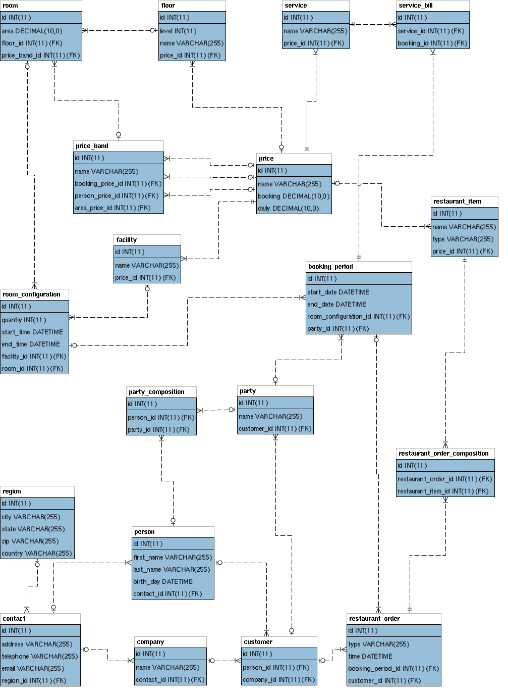

# Hotel Database
---
# Required Input
The hotel Database is filled with the following Data:

- floors
- rooms
- customers
- bookings
- room service usage
- restaurant orders
- types of facilities
- price bands

---
# Required Output
The hotel Database provides the following Data:

- past, future and current bookings
- available rooms
- list of customers
- customer bill based on room, services and extras

---
# Structure of the Database

